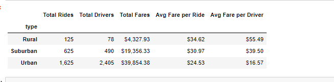
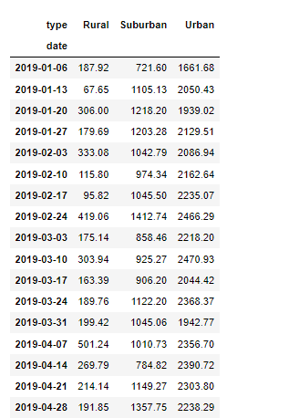
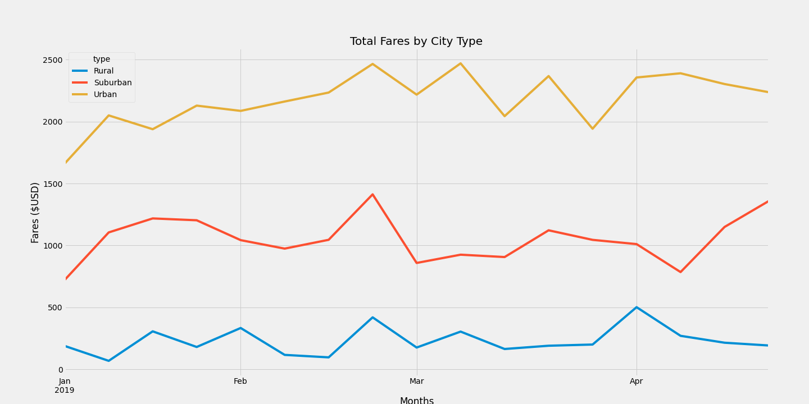

# PyBer_Analysis
### V. Isualize wants to analyze all the rideshare data from January to early May of 2019 
We want to create a visual representation of the data of rideshare for the total numbers of rides, the total number of drivers, the fares, the average fare per ride, and the average fare per driver the for the 3 city type in urban, rural, and suburban areas. 
##  Resources used
•	Data Source: city_data.csv and ride_data.csv

•	Software: Python 3, Anaconda , Jupyter Notebook 

## The Results

In this dataframe we can see that the average fare per ride and average fare per driver in the rural cities has the higher average fares, even though it has the least amount of rides and drivers. whereas it’s the opposite for the urban cities, the average fares if much lower even though there are more rides and more drivers. That could be because the rides are much shorter and more frequent in urban cities 
Base on this dataframe and the multiple-line chart we can see that the urban cities consistently show a higher total fare amounts when compared to the suburban and rural cities on a weekly bases. People in the rural and the suburban cities might have their own cars thus not needing to utilize Pyber. whereas urban cities are more populated, so people rather take a rideshare service and avoid finding a parking spot their final destination

## Summary
We can clearly see from the data when there are more drivers there will be more riders. There is no doubt that the urban cities are where the money is at. So if that is something V. Isualize wants to focus on, she should do just that, hire more drivers in the urban cities, but if she is satisfied  with the way things are at the urban cities and she want to focus on the rural and suburban areas, she should hire more drivers there, that way the riders wont have to wait a long time for a drivers, when and if they request for a ride. And since the average fares is much higher in these cities, that could be another reason why there isn’t as much potential riders, V. Isualize could run some promotions on certain days and certain times in the day, so that could attract more potential riders.
